

     

# ParrotLUX (Version: 2024.05.16-1-alpha)
A Painting App for Open-Source AI

This app is currently in the clean-up stages of Alpha version. Bugs are being fixed and minor missing features are being added. The beta version (publicly usable) will release soon. Tuturials and documentation will be added soon.

       

# Cross-Platform
This app has been tested in Chrome on: Android, *Windows 11, and Ubuntu.

(*Pen pressure is unavailable on Windows.)

(It may also work on MacOS and iOS. Untested.)

# New Features in Version 2024.05.16-1-alpha

## Unsaved Data Warning

When closing or navigating away from the app, or when opening a new project, if there are any unsaved changes, the app will ask you to confirm before deleting those unsaved changes.

## Bug Fixes

Fixed bugs:
    <ul>
        <li>During transform, using the rotation and scale sliders after the pinch gesture would make the layer "jump". Now fixed.</li>
        <li>During transform, the rotation and scale slider values would change slightly after being manually typed in (typed in "45", slider became "44"). Now fixed.</li>
        <li>During transform, using the rotation slider to rotate a non-square layer would squash it (view height and view width would be swapped). Now fixed.</li>
        <li>During transform, changing the X and Y transform sliders did not update the layer's position. Now fixed.</li>
        <li>During transform, changing the layer selection did not update the slider's displayed values. Now fixed.</li>
        <li>When transforming with multiple layers selected, crop-width and crop-height would still be displayed (cannot crop multiple layers). Now fixed.</li>
        <li>Re-opening the same project twice would duplicate layers. Now fixed.</li>
        <li>Pressing the "Escape" key would lock all layers in place and prevent painting. Now fixed.</li>
        <li>"Escape" and "Enter" keys were not closing or applying on the asset browser window. Now fixed.</li>
        <li>"Escape" and "Enter" keys were not closing the settings window. Now fixed.</li>
        <li>Using "undo" after the first paint stroke of a layer mask would turn the layer invisible. Now fixed.</li>
        <li>After an image mask had been created, it could not be un-created with "undo". Now fixed.</li>
    </ul>

# New Features in Version 2024.05.15-1-alpha

## Lasso Features

Added more lasso minor features (all of these support multi-layer selections):
    <ul>
        <li>Invert Lasso - <i>While activated, the non-lassoed area becomes the lassoed area, and the lassoed area becomes the non-lassoed area.</i></li>
        <li>Cut Out Lassoed Area - <i>Create new layer(s) containing the contents of lassoed area from selected layer(s). In the selected layer(s), the contents of the lassoed area are made transparent (clear).</i></li>
        <li>Duplicate Lassoed Area - <i>Create new layer(s) containing copies of lassoed area from selected layer(s).</i></li>
        <li>Delete Lassoed Area - <i>Delete contents of lassoed area inside selected layer(s).</i></li>
    </ul>

## Bug Fixes

Fixed bugs:
    <ul>
        <li>Fixed bugged lasso state after re-opening project.</li>
    </ul>

# New Features in Version 2024.05.14-1-alpha

## User Interface Optimization

The user interface (hovering and clicking buttons) is now 30% to 50% faster depending on the device.

## Bug Fixes

Fixed bugs:
    <ul>
        <li>New layer names were sometimes skipping numbers. Now fixed.</li>
        <li>Duplicating a pose layer now correctly copies its pose to the new layer.</li>
        <li>The alpha-lock button now displays correctly depending on each layer's activation status.</li>
        <li>Duplicated layer names now show "(copy)" to indicate which is the original.</li>
        <li>Duplicated groups were glitching when closed. Now fixed.</li>
    </ul>

# New Features in Version 2024.05.13-1-alpha

## Major Feature: Lasso

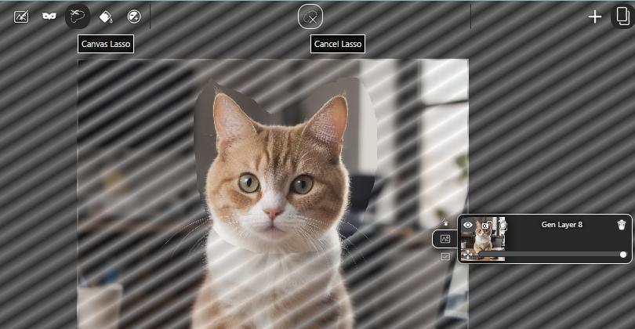

The lasso tool allows you to draw a lasso area. Painting, masking, flood-filling, and color-adjusting will affect only the lassoed area. <i>(The abilities to transform, delete, and duplicate the lassoed area of the selected layer(s) will be added soon, as well as lasso-editing features including add/subtract, invert, expand/contract, feather, and transform.)</i>

# New Features in Version 2024.05.07-1-alpha

## Multi-Layer Paint, Mask, and Flood-Fill

Paint, mask, and flood-fill now all work correctly when you have multiple layers selected, or a group selected. You will automatically paint, mask, or flood-fill whichever layer you click inside of. <i>Multi-layer color adjust, multi-layer AI-generate, and multi-layer AI-tools still do not work.</i>

## Bug Fixes

A few UI-glitches fixed, including tool-lock that was preventing masking generative layers.

# New Features in Version 2024.05.04-2-alpha

## Bug Fixes

Fixed pen-pressure bug on Android. New feature settings now populate correctly when updating an existing install, instead of defaulting to 'undefined'.

# New Features in Version 2024.05.04-1-alpha

## View Controls

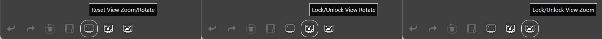

You can now find view controls in the bottom-left corner of the app, beside the undo/redo buttons. These allow you to reset the view's zoom and rotation, or to lock rotation or zoom. <i>(If rotation is locked, the pinch gesture will only pan and zoom the view, so you can keep your drawing right-way-up. If zoom is locked, the pinch gesture will only pan and rotate the view, so you can keep your drawing at a fixed size.)</i>

## Bug Fixes

Bug fixes include one resulting in saved projects not loading.

# New Features in Version 2024.04.27-1-alpha

## Alpha Lock on Paint Layer

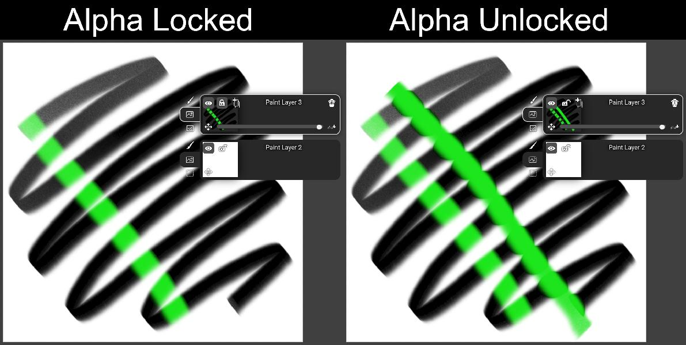

There is now an "alpha lock" icon on the paint layer button, in the top-left next to the visibility icon. When activated, paint strokes will appear only on top of already-painted regions of the layer.

# New Features in Version 2024.04.24-1-alpha

## Brush Custom Paper-Texture Effect

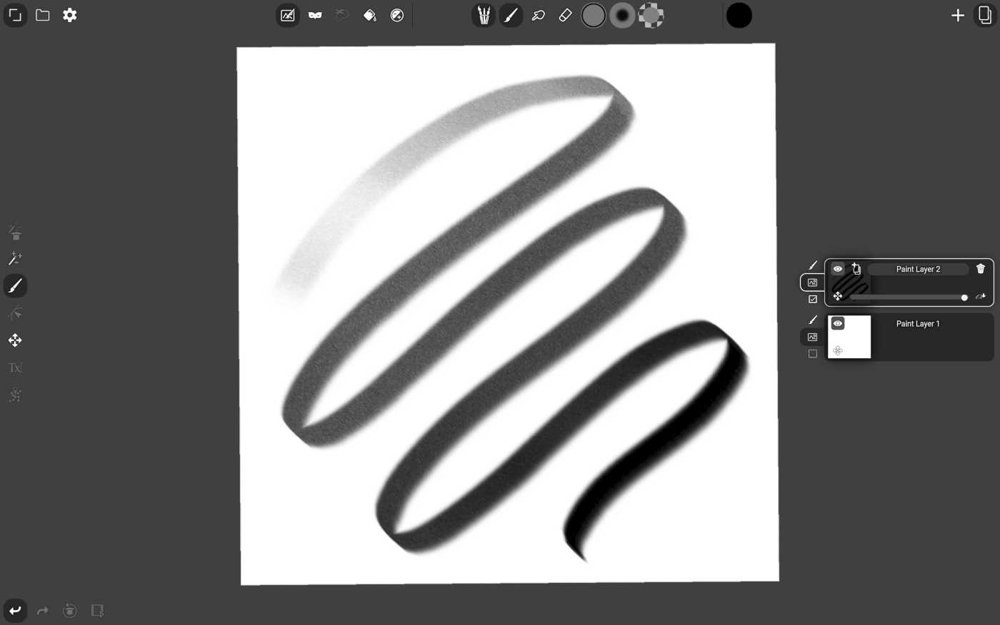

Brushes now support a customizable textured appearance (like paper, for example). When creating a custom brush in-app, the brush's texture will be uploaded as a second image along with uploading the image definining the brush's tip. The intensity of the texture effect will be defined as a point-curve controlled by the pen pressure dynamics--the same as opacity and scale. Currently, only the built-in "Pencil" brush has a texture effect applied by default. <i>(Currently, custom brushes can only be created and edited by modifying the .json files in the "/res/brushes" directory. In-app brush editing will be available in beta.)</i>

## Single-Click AI Tools

# New Features in Version 2024.04.22-1-alpha

## Single-Click AI Tools

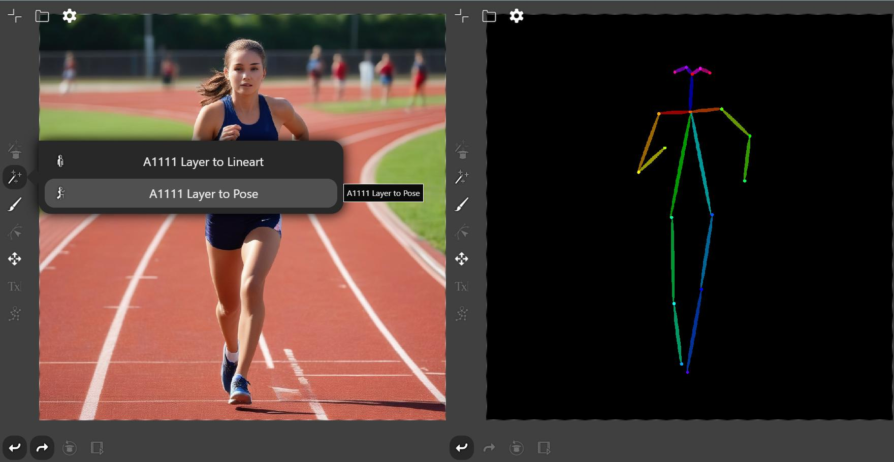

Single-Click AI Tools are quick, one-click shortcuts for triggering generative APIFlows. They have all the same power and flexibility as full APIFlows: completely user-creatable, modifiable, and sharable, and capable of connecting to any API backend whether local or in the cloud. But, when using single-click tools, there is no need to configure settings, create new generative layers, or configure layer node-links. Just select a paint layer, single-click the desired tool, then keep working without interruption.

Two example tools ship with the app by default for now, and more will be added soon. Also, these tools are the first to include user-customizable icons, which display alongside the tool's name. :-) Many more custom-image features will soon follow! <i>(Tags, search, favorites, and list-filtering for single-click tools and other assets will be available in beta.)</i>

# New Features in Version 2024.04.20-1-alpha

## Bug Fixes

At least a few bugs have been fixed: Black background on fullscreen. Number-sliders not working right. <i>(Finally at least a couple bugs fixed!!!)</i>

## Smartphone User Interface Improvements

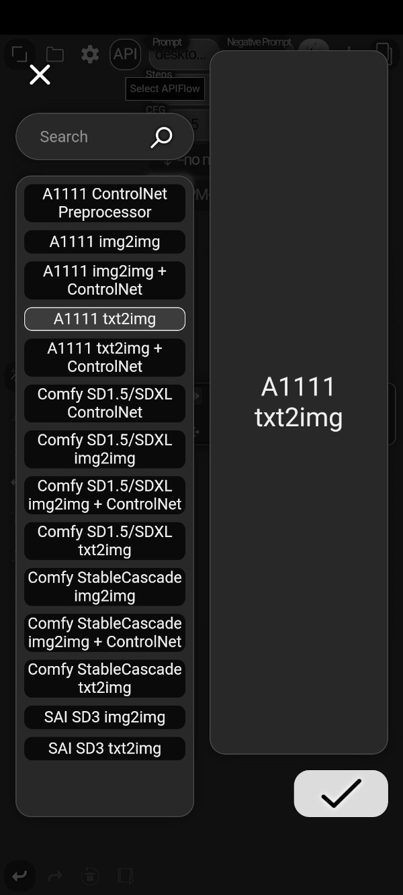 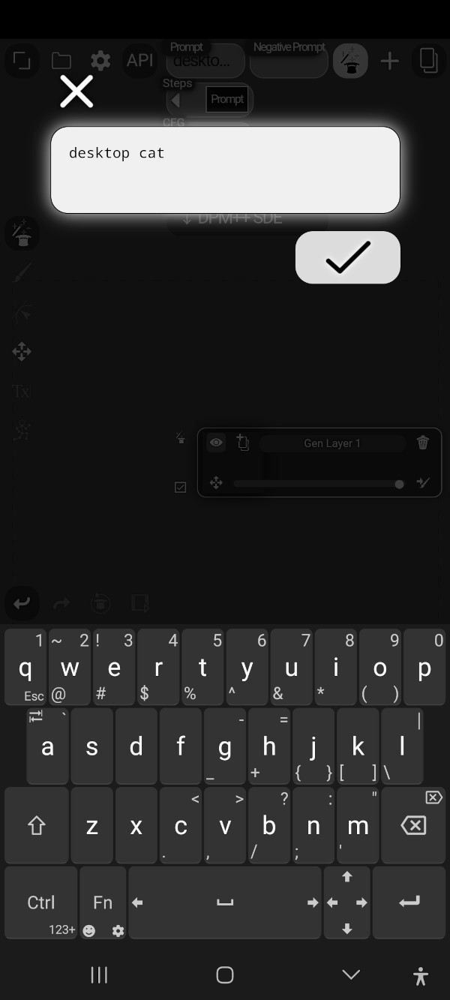

The user interface for portrait-orientation on phone-sized displays is now slightly more usable for text-to-image generation. <i>(Smartphone-display & non-stylus support still needs much more work. Only tablet-sized or larger displays with stylus and/or mouse are supported for now.)</i>

# New Features in Version 2024.04.19-1-alpha

## Flatten Layer Group

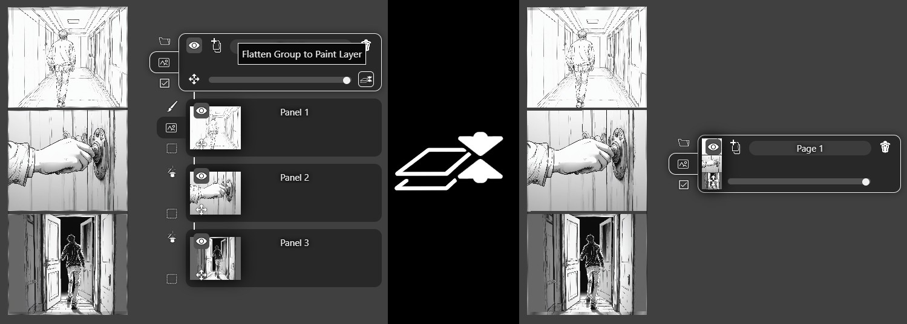

Flatten Layer Group creates a new, large paint layer containing all flattened layers, while preserving their relative positions on the canvas without clipping. You can find the Flatten Group button in the lower-right corner of the layer's button. <i>(Not yet compatible with multi-frame layers.)</i>

# New Features in Version 2024.04.18-1-alpha

## Stable Diffusion 3 Support

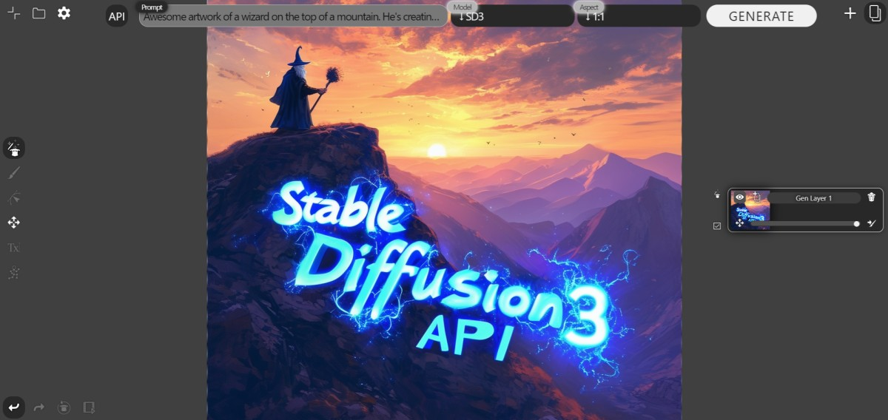

Via the StabilityAI API. Includes img2img and txt2img. APIKey required. <i>(Install APIKey in settings.)</i>

## Tightened User Interface and New Icons

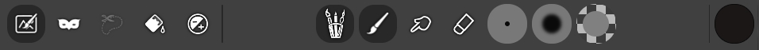

The user interface now fits on smaller screens without zooming out. Brush select now has an icon. All canvas tools have moved to one place. Erase, blend, and mask now have easy-to-read icons. <i>(Bugs with number sliders, element sizes, and phone-screen-sized overflows to be fixed ASAP.)></i>

## Select Multiple Layers

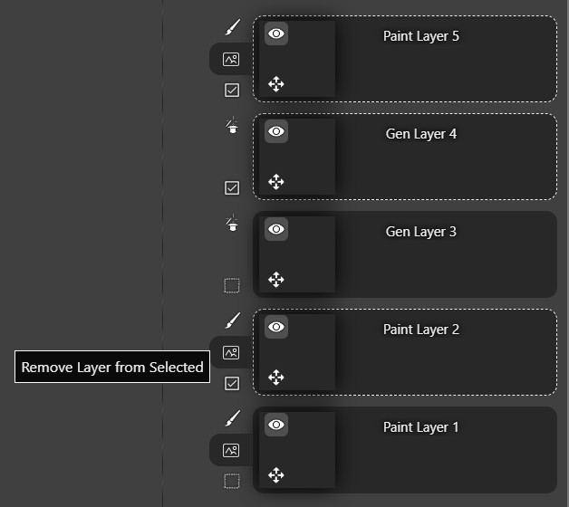

Use the checkbox in the lower-right. Drag multiple layers to groups, transform multiple layers, paint on multiple layers, and color adjust multiple layers at once. <i>(This feature has tons of known bugs to be fixed ASAP.)</i>

# Installation

### Requirements
* NodeJS. You can install it from [https://nodejs.org/en](https://nodejs.org/en).
* A PC running ComfyUI or Automatic1111 stable-diffusion-webui. You can install whichever you prefer from [https://github.com/comfyanonymous/ComfyUI](https://github.com/comfyanonymous/ComfyUI) or [https://github.com/AUTOMATIC1111/stable-diffusion-webui](https://github.com/AUTOMATIC1111/stable-diffusion-webui).
    * ComfyUI should run on port 8188
    * A1111 should run on port 7860
    * The app will support configuring ports etc. in the future
* The Chrome or Chromium browser, running on Android, Windows, or Linux.
    * MacOS and iOS are untested.

### Install
1. Clone this repository to a directory on your local device.
2. From the terminal, at the top-level of the repository, run `node server.js`.
    * Note the address `http://{local_ip_address}:6789/` logged in the terminal.
3. On your Android tablet, launch Chrome and navigate to that address. (Only Chrome on Android is supported for now.)
4. Tap the full-screen icon in the top-left. :-)  

# Features

- Standard Interface
    - Save, load, and export projects
    - Undo and redo
    - Import images as layers
    - Multitouch pan/zoom/rotate
- Layers
    - Rename
    - Merge, duplicate, delete
    - Set opacity and visibility
    - Organize layer groups
    - Non-destructive masks
    - Multitouch transform
    - Resize generative layers
    - (filters coming in Beta)
    - (number-slider transform in Beta)
- Painting
    - Pressure sensitive brushes
    - Softness
    - Opacity
    - Erase
    - Blend
    - GPU optimized
    - (more default brushes coming in Beta)
    - (user-custom brushes coming in Beta)
- Generation
    - Text-to-Image
    - Image-to-Image
    - ControlNet
    - ControlNet Preprocessors
    - Inpainting
    - A1111 and Comfy
    - SD1.5, SDXL, and StableCascade
    - (user-custom apiflows coming in Beta)
- Flood fill
    - area or color
    - padding border
- Posing
- Color Adjustment
    - Saturation
    - Contrast
    - Brightness
    - Hue
    - Invert
- More features coming in Beta!