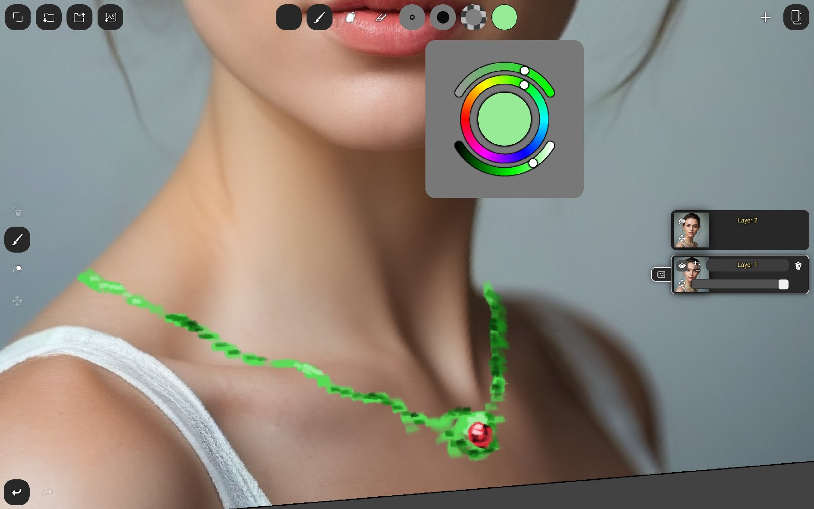
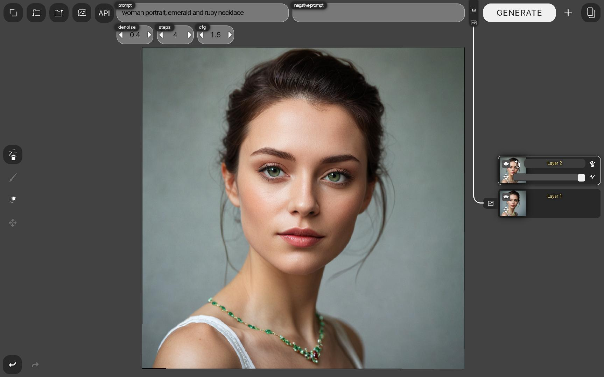

# Tempera
A Pen-Tablet Painting App for Open-Source AI

**Currently pre-alpha!** Supports Android tablets. May support iPad.

# Paint + AI = Magic
Do you want the power and convenience of a modern touchscreen-tablet painting app combined with easy text-to-image, image-to-image, and controlnet?  
Tempera is an open-source art app, built around open-source AI, designed for artists.

Run Stable Diffusion on your PC using A1111 or Comfy, and connect to it via the art app on your tablet. Alternatively, run any other platform on any device or in the cloud. Tempera supports all network-based APIs by implementing a universal, user-customizable APIFlow system. Create, download, and share APIFlows complete with sleek in-app controls.

**But, again, it's currently in pre-alpha!** Please be patient for all the awesomeness to come.

## Beautiful Painting Workflow & Interface
The sleek multi-touch interface and fine-tuned brush controls match standard painting apps for art tablets. **Currently in pre-alpha! Stay tuned for much-needed performance improvements and tons of additional features.**

## Text-to-Image + Painting
Generate images with text-to-image, powered by Stable Diffusion running on your local PC (or via any network API), using whatever models and custom tooling you want. Adjust generation settings from the app's clean and intuitive interface. **Currently in pre-alpha! Stay tuned for a full suite of settings and API interfaces, plus the ability to easily and quickly make your own.** As powerful as your backend, yet as intuitive as an art app. Convert the generated image to a paint layer, and paint away.

## Image-to-Image from Painted Layers
Generate images from your painted layers with new prompts. Drag-and-drop to hook up layers for image-to-image input or controlnet input, type prompts, configure settings, and generate.

## ControlNet
Coming very soon! Lineart, upscaling, pose, and much more. :-)

## Installation

### Requirements
* Either: a PC running ComfyUI. You can install it from [https://github.com/comfyanonymous/ComfyUI](https://github.com/comfyanonymous/ComfyUI).
    * Run on port 8188
* Or: a PC running Automatic1111 stable-diffusion-webui. You can install it from [https://github.com/AUTOMATIC1111/stable-diffusion-webui](https://github.com/AUTOMATIC1111/stable-diffusion-webui).
    * Launch with command line arguments `--listen` and `--api`
    * Run on port 7860
* An Android tablet with a pen stylus input (for example, a Samsung Galaxy Tab), with Chrome installed.
    * iPad and Safari may be supported in the future.

### One-Click Install
Coming very soon! Windows binary and Android APK will be available.

### Manual Install Requirements
* NodeJS. You can install it from [https://nodejs.org/en](https://nodejs.org/en).

### Manual Install
1. Clone the repository to a directory on your local device.
2. From the terminal, at the top-level of the repository, run `node server.js`.
    * Note the address `http://{local_ip_address}:6789/` logged in the terminal.
3. On your Android tablet, launch Chrome and navigate to that address. (Only Chrome on Android is supported for now.)
4. Tap the full-screen icon in the top-left to dive into the app and begin. :-)  

**Currently in pre-alpha! Full tuturials and documentation will be coming soon.** The app's layout is standard and hopefully intuitive, and there are tooltips.

## Features: Done & To-Do
- ✅ Sleek and Beautiful UI
- ✅ Input
    - ✅ Pinch to zoom / rotate / pan
    - ✅ Pen Stylus
    - ✅ PenPressure & Tilt
    - ❌ Gestures triple-tap+drag
    - ❌ Mouse Input
        - ✅ Some
        - ❌ All
    - ❌ Keyboard Shortcuts
        - ✅ Some
        - ❌ All
- ✅ Layers
    - ✅ Paint
    - ✅ AI Generation
    - ✅ Merge
    - ✅ Duplicate
    - ✅ Delete
    - ✅ Visibility
    - ✅ Opacity
    - ✅ Masks
    - ✅ Rename
    - ✅ Reorganize
    - ✅ Layer Groups
        - ✅ Use as Gen Souce
        - ❌ Flatten
- ✅ Undo / Redo
- ✅ Save / Load
- ✅ Import image
- ❌ Gallery View (Android APK only?)
- ✅ Export
- ❌ Settings Panel
- ✅ Paint
    - ✅ Brush tip image
    - ✅ Pressure & tilt dynamics
    - ✅ Size
    - ✅ Opacity
    - ✅ Softness
    - ✅ Colorwheel
    - ✅ Eyedropper
    - ❌ Custom brushes asset browser
    - ✅ Erase
    - ✅ Blend (on solid layers)
    - ❌ Blend (on transparent layers)
    - ❌ GPU Paint
- ✅ AI Generation
    - ✅ Image inputs UI
    - ❌ Generation history
    - ✅ Universal APIFlow System
    - ✅ Builtin APIFlows
        - ✅ A1111 img2img / inpainting-with-mask (demo)
        - ✅ A1111 txt2img (demo)
        - ❌ A1111 controlnet (demo)
        - ✅ A1111 controlnet preprocessor (demo)
        - ~~❌ A1111 upscale (demo)~~ (A1111 extras API currently broken)
        - ✅ Comfy img2img / inpainting-with-mask (demo)
        - ✅ Comfy txt2img
        - ❌ Comfy controlnet (demo)
        - ❌ Comfy controlnet preprocessor (demo)
        - ❌ Comfy upscale (demo)
    - ❌ Design custom APIFlows in-app
    - ❌ Export / Import / Share APIFlows
- ✅ Layer Masks
    - ✅ Paint
    - ✅ Erase
    - ❌ Blend
- ✅ Layer Transforms
    - ✅ Translate
    - ✅ Scale
    - ✅ Rotate
    - ❌ Flip
    - ❌ Crop / Uncrop
    - ❌ Snap
    - ❌ Arrange / Distribute
- ❌ Paint Mirror Symmetry
- ❌ Filters
    - ❌ Basic (Hue,Saturation,Luminance,Contrast...)
    - ❌ Channels
- ❌ Text
    - ❌ Text layer
    - ❌ Import fonts in asset browser
- ❌ Flood Fill
- ❌ Clone / Heal Tool
- ❌ Geometry Lines & Shapes
- ❌ One-click Install
    - ❌ Downloadable APK
    - ❌ Compiled Windows Binaries
- ??? More Stuff ???